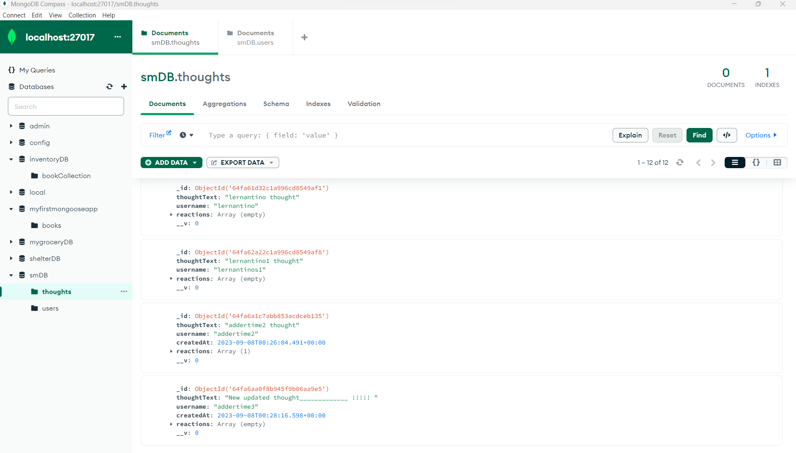
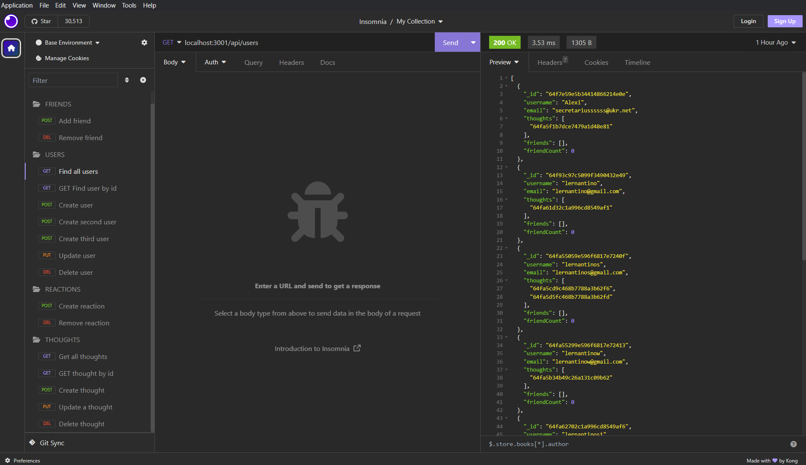

# Social-network-api

## User Story
AS A social media startup
I WANT an API for my social network that uses a NoSQL database
SO THAT my website can handle large amounts of unstructured data

## Description
Social-network-api is a social network web application where users can share their thoughts, react to friends’ thoughts, and create a friend list. 

## Github reference
https://github.com/secretariuss/social-network-api

## Video reference
https://drive.google.com/file/d/1YoFmvkME4i2euWVzFD_OXeG9zcSP7jOJ/view

## Screen shots

The following scrshots shows the web application's:

## Acceptance Criteria
GIVEN a social network API
WHEN I enter the command to invoke the application
THEN my server is started and the Mongoose models are synced to the MongoDB database
WHEN I open API GET routes in Insomnia for users and thoughts
THEN the data for each of these routes is displayed in a formatted JSON
WHEN I test API POST, PUT, and DELETE routes in Insomnia
THEN I am able to successfully create, update, and delete users and thoughts in my database
WHEN I test API POST and DELETE routes in Insomnia
THEN I am able to successfully create and delete reactions to thoughts and add and remove friends to a user’s friend list

  ## Table of Contents
  * [Installation](#installation)
  * [Usage](#usage)
  * [How to Contribute](#how-to-contribute)
  * [Questions?](#questions)
  
  ## Installation
  Use in the terminal, clone from github, run npm install
  ## Usage
  npm run start
  run insomnia or postman application and put routes from example:
  
    GET/ POST routes:
    `http://localhost:3001/api/users`
    `http://localhost:3001/api/thoughts`

    PUT/DELETE routes:
    `http://localhost:3001/api/users/:id`
    `http://localhost:3001/api/thoughts/:id`

    POST/ DELETE routes:
    `http://localhost:3001/api/users/:id/friends/:friendId`
    `http://localhost:3001/api/thoughts/:id/reactionsId`

  ## How to Contribute
  [Contributor Covenant](https://www.contributor-covenant.org/)  
  In contributor covenant

  ## Questions?
  ### Reach me here: 
  [secretariuss](https://github.com/secretariuss)  
  secretarius@ukr.net
